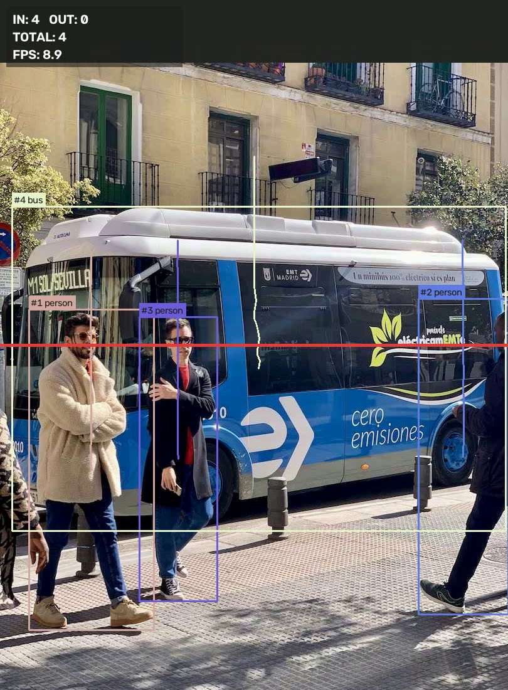
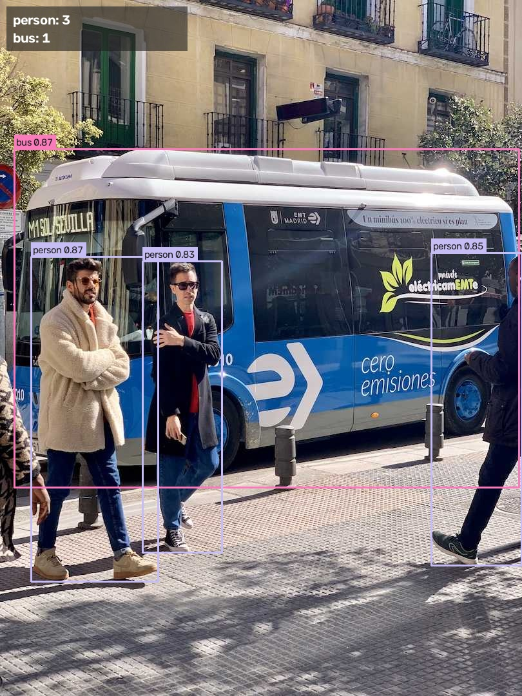

# VisionCount — Real-Time Object Detection, Tracking & Counting

**YOLOv8 · ByteTrack · OpenCV · Streamlit · Python**

VisionCount detects objects in images, video files or a live webcam. It tracks each object with a stable ID and counts objects as they cross a line you choose. You can use it to count people at an entrance, vehicles on a road, or products on a conveyor belt.



## Features

- **Detection:** finds 80 COCO classes with any Ultralytics YOLO model (`yolov8n/s/m.pt`, or your own trained weights).
- **Tracking:** ByteTrack gives each object a persistent ID and draws its motion trail.
- **Line-crossing counter:** counts IN and OUT separately, with a breakdown per class. Each object is counted only once per direction.
- **Class filter:** you can count only some classes, for example `--classes person car`.
- **Inputs:** images, video files, RTSP/HTTP streams and webcams.
- **Outputs:** an annotated image or video and a JSON summary.
- **Streamlit web app:** upload a file, adjust confidence, classes and line position, then download the results.
- **Unit tests:** cover the counting geometry (`pytest`).

## Results

These numbers come from the included sample run on CPU with `yolov8n.pt`:

| Input | Output |
| --- | --- |
| `assets/bus.jpg` | 3 people + 1 bus detected (conf 0.83–0.87) |
| `assets/demo_pan.mp4` (60 frames) | 4 tracked objects, 4 line crossings counted, ~9 FPS on CPU |



## Quick start

```bash
git clone https://github.com/Rashid1455/visioncount.git
cd visioncount
pip install -r requirements.txt

# Image: detect and count each class
python detect.py --source assets/bus.jpg

# Video: track and count line crossings, then save the result
python detect.py --source assets/demo_pan.mp4 --save outputs/out.mp4 --json outputs/summary.json

# Webcam with a live window (press q to quit)
python detect.py --source 0 --show --classes person

# Custom counting line (x1,y1,x2,y2)
python detect.py --source traffic.mp4 --classes car truck bus --line 0,400,1280,400

# Web app
streamlit run app.py
```

The YOLO weights download automatically on the first run.

## How it works

1. **Detect:** YOLO predicts bounding boxes, classes and confidence for each frame.
2. **Track:** ByteTrack links detections across frames, so each object keeps the same ID.
3. **Count:** the centre of each box is checked against the counting line using the sign of a cross product. When the sign flips, and the point lies within the segment, the object is counted as IN or OUT. This logic is in `visioncount/counter.py` and has no model dependency, so it can be tested on its own.
4. **Draw:** OpenCV draws the boxes, IDs, trails, the line and a live stats panel.

## Project structure

```
visioncount/
├── visioncount/
│   ├── counter.py     # line-crossing geometry (pure Python, unit tested)
│   └── pipeline.py    # YOLO + ByteTrack + OpenCV drawing
├── detect.py          # CLI
├── app.py             # Streamlit app
├── tests/             # pytest
└── assets/            # sample inputs
```

## Tests

```bash
pytest -q
```

## Next steps

- Fine-tune YOLO on a custom dataset (for example local vehicle types) and report mAP.
- Export to ONNX/TensorRT for faster inference on edge devices.
- Support polygon zones as well as single lines.

## Author

**Rashid Ali**: Computer Vision & AI Engineer · [LinkedIn](https://www.linkedin.com/in/rashid-ali-619671357)

MIT License
